[](https://github.com/Tryd0g0lik/krypto_market/actions/workflows/main.yml)

Note: Публикация файлов не нарушило условий задания 
Суть работы: 
- Подключение к Deribit (crypto биржа).
- Получение данных пользователя.
- Подписка на  получение данных курса по ticker-у с временным интервалом.
- Отмена подписки.
- Получение данных с фильтром даты.

## APP CryptoMarket


Мы знаем - Полиморфизм. Но это в ООП. Тут же говорю о целом APP. Стараюсь делать единый код для выполнения разных задач \
изменения только в args/kwargs

---
Да, понимаю, что работа занимает более 10 дней указанного deadline. Но и \
делать по принципу "а лишь бы было" нет желания. \
Да, мог сделать:
- HTTP запросы напрямую по внешнему API.
- Без кеширования. 
- Без update базы данных.
- Без шифровани данных.
- С одной базой данных.

Но, сделал:
- SSE, WSS, HTTP.
- плановое и по мере запроса - кеширование.
- обновление данных.
- шифрование секретных ключей (не путать с хешем и кешем).
- с двумя базами данных. Для переключения использовать переменную "`DEBUG`" из "`.ENV`".
- базы данных на синхронном и/или асинхронном драйвере, для каждой из базы ("`SQLite`" & "`PostgreSQL`").
- Запуская docker-compose арр само создаёт базу данных, проверят и добавляем (`DEBUG` укажите `Fasle`) schema "`crypto`".
- В зависимости от "`DEBUG`" таблицы из базы данных имеют своё уникальное имя.
- файл swagger загрузите в Postman.
 web-api список по url ниже.

Работа представляет 3-ю версию кода которую готов отправить. 

 - В 1-ой версии. Когда получаем access токен, закрываем соединение. Далее по токену делаем новое подключение для получения \
   новых данных. Но токен выдается именно на сессию/подключение и после закрытого подключения к Deribit токен использовать не было возможности.  
 - В 2-ой Получил ограничение по трафику (до 15 запросов в секунду). Стал терять запросы в локальной очереди (asyncio.Queue).
 - Когда один API запрашиваем от APP 9а не от пользователя). Пользователь получает данные уже из db. Снижаем нагрузку.

Возможно стоит учесть, что с этой биржей работал в первый раз. Работа была без какого либо ТЗ, всё создавалось на ходу.\
Всё это потребовало время.


### Коротко 
[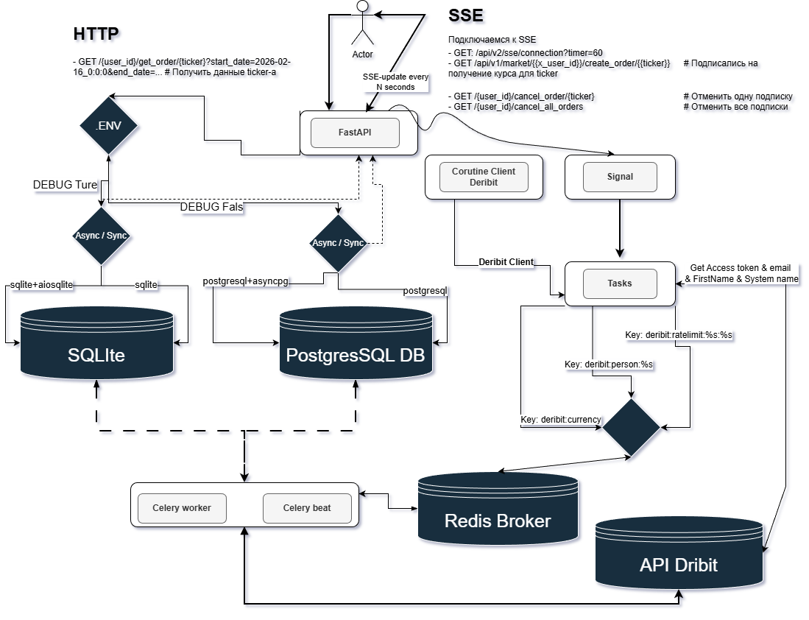](img/Logic_visualization.png)


Микросервесный блок в промежутке между основным арр и Deribit.\
[Имеет свою базу данных](cryptomarket/models):
 - "`crypto_person`" она же "`crypto.person`";
 - "`crypto_person_prices`" она же "`crypto.person_prices`";
 - "`crypto_price_tickers`" она же "`crypto.price_tickers`". 
Для лёгкого восприятия таблиц (в недрах базы данных) для SQLite добавлен префикс "`crypto_`", \
a для PostgreSQL добавлена схема "`crypto`" с таблицами.

**В .ENV файле:**\
Меняем "`True`" на "`False`" или "`False`" на "`True`":
 - если "`True`" [работаем с](cryptomarket/database) PostgreSQL. "`PROJECT_MODE`" в режимах: "`testing`", "`development`", "`production`" - чтоб не грохнуть основную базу данных.
 - если "`False`" работаем SQLite.

**Про патоки**
На этапе запуска движка создаётся упаковка из 10-ти корутинов.\
Каждый корутин - client [для подключения к Deribit](cryptomarket/deribit_client/deribit_clients.py)./
По мере необходимося вытаскиваем корутин и обращаеся к Deribit. \
Как только вытащили из коробки один корутин, туда добавляется новый корутин и опять их 10 шт. Все эти процессы\
не занимают основной и дополнительный поток данных. Но это не единственный дополнительный поток данных. 

**Про Docker**
[docker-compose](docker-compose.yml) имеет лимиты на расход памяти RAM. Я работаю на тарифе с 1G RAM. Поэтому \
Дополнительно к лимитам в docker-compose пришлось создавать Swap-файл (для сервера) и закомментировать:
- "`adminer`";
- "`flower`". Они рабочие и просто раскомментируйте блоки и уберите лимиты памяти (на всём docker-compose) если необходимо.

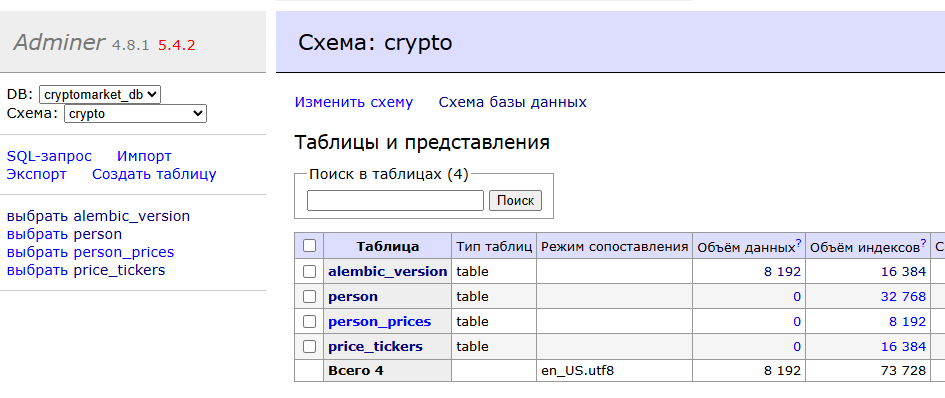

#### Note
- [Настройки](cryptomarket/project/settings/core.py) по желанию.
- [Celery](cryptomarket/project/celery_.py).
- [Модели](cryptomarket/models) базы данных.
- [Менеджер](cryptomarket/deribit_client) для работы с Deribit.
- C Deribit работаем [через WebSocket](cryptomarket/deribit_client/deribit_websocket.py)
- Все блоки (Celery, App, Database и Задачи), между собой работаю через cache.

## Что под капотом

Person чтоб арр не:
- зависела от пользователей,
- и не несла ответственности за действия пользователей.

1. Подключаемся по SSE. 
2. Отправляем ticker в качестве подписки для получения свежих данных из crypto-биржи. Отправляем запрос с "`btc_usd`"\
    затем с "`eth_usd`" и ждём данных в SSE ленте.
3. Возможно отписаться от одного из наименований или всех разом.
4. Получить данные по фильтру дат. При этом "`start_date`" меньше "`end_date`" (datetime строго по шаблону). Можно и без "`end_date`".  

----

### Подключаемся по SSE
Отправляем запрос и:
- основной поток подключается к SSE.
- дополнительный поток данных отправляет запрос на Deribit OAuth. Если пользователь там зарегистрирован, получаем \
access tokens и данные пользователя (имя, почту). Пользователь в виде образа (конкретной личности) [сохраняется в менеджере](cryptomarket/deribit_client/deribit_person.py),\
и на 27 часов в кеше. Через задачу и Celery в полночь загружаем данные в базу данных. В данный момент сервер загрузки \
даных о пользователе не создан/востребован (но если надо, сделаю). Данные (время жизни) в кеше часто обновляются.

-Authentication https://docs.deribit.com/articles/authentication 

#### Note
Запрос на подключение к SSE включает в себя обязательные "`client_id`" & "`client_secret`".\

Под капотом данные полльзователя перехватываются и **шифруются**. Секретный ключ от шифра через кеш передается к месту где\
"`client_id`" & "`client_secret`" используются по назначению.

Уже из кеша , когда получаем этот ключ (в одной из задачи) то де-шифровка секретного текста для аутентификации пользователя.\
Данные об успешной авторизации кешируем на 27 часов. 

Каждый пользователь имеет разовый уникальный ключ шифра на время жизни секретных данных (time live 10-15 секунд). 
Ключи это результат авто-генератора. 

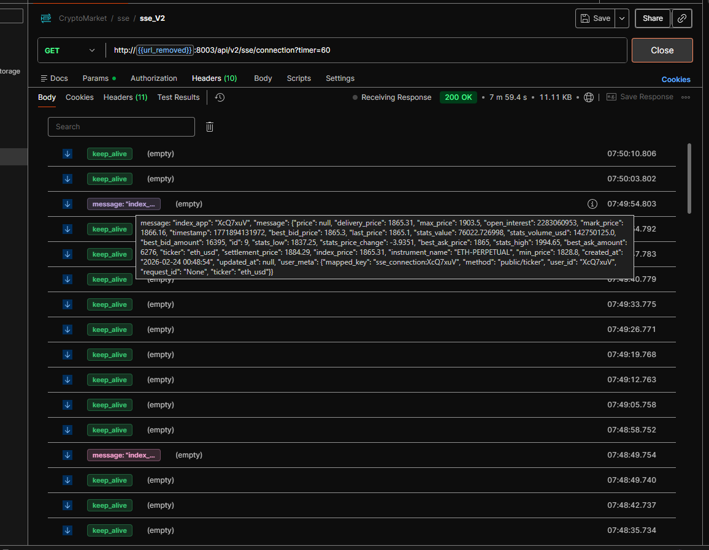

----
### Celery
- "`task_add_...`" После установки личности пользователя отправляю  (с интервалом времени 50 секунд) \
запрос на получения данных по курсу валюты. \
- "`task_send_....`" каждые 45 секунд заглядывает в базу данных (SQLite or PostgreSQL) берёт последнюю строку и сохраняет в кеш упакованные для SSE.

| **Сделайте**                                                  **клик**                          |
|:------------------------------------------------------------------------------------------------|
| **Celery на 127.0.0.1**                                                                         |
| [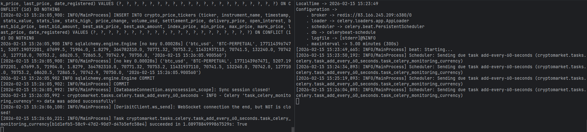](./img/celery_deribit.png)                           |
| **Celery beat на внешнем IP**                                                                   |
| [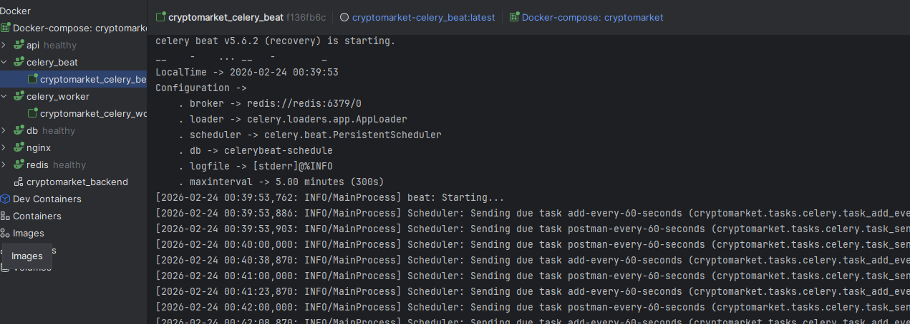](./img/postgres_celery_beanr.png)    |
| **Celery worker на внешнем IP**                                                                              |
| [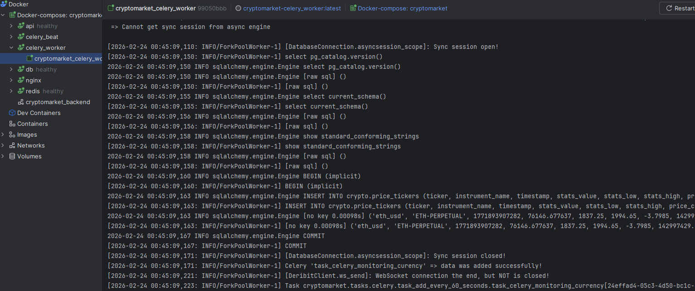](./img/postgres_celery_worker.png) |
|                                                                                                 |

----
### Модели базы данных
Три модели, но по факто рабочая [только одна](cryptomarket/models/schemes/model_prices.py). \
Две другие предусмотрены для расширения микро-сервисного блока.

|**Сделайте**||**клик**|
|:-----|:-----|:-----|
|[](./img/database_view.png)|[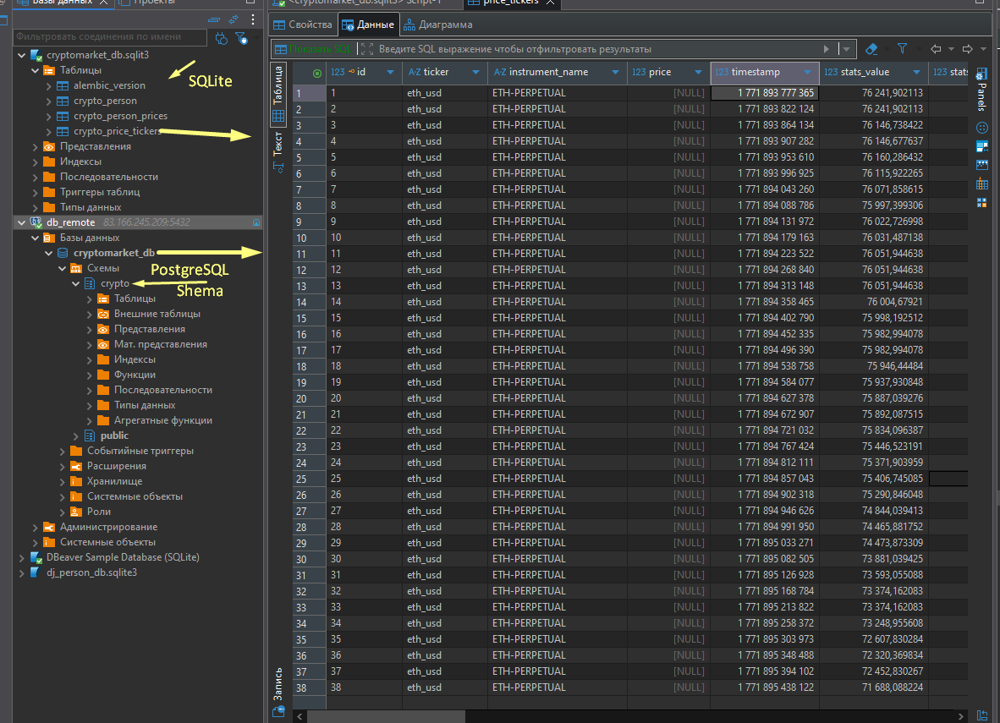](./img/dabase.png)|[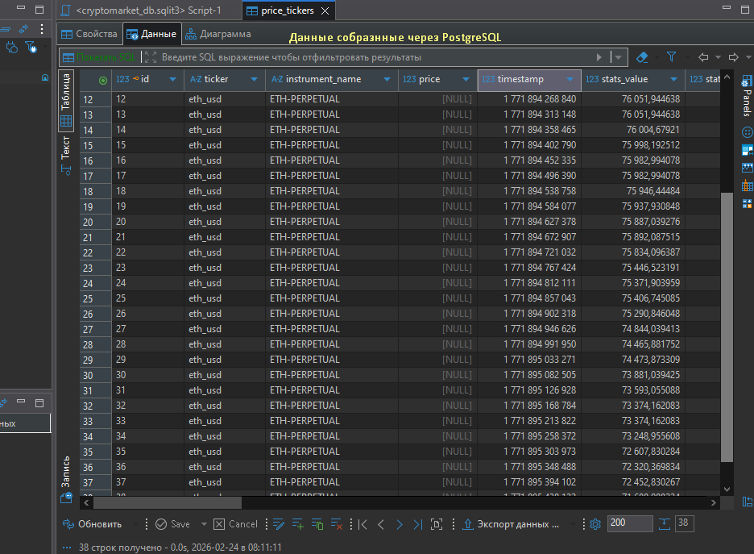](./img/Postgres_data.png)|
||||

----
### Log на сервере - сборка Prodo
*Сделайте клик по скрину.*

|**Docker**||**PostgreSQL**||**Redis**||**APP**||
|:-----|:-----|:-----|:-----|:-----|:-----|:-----|:-----|
| [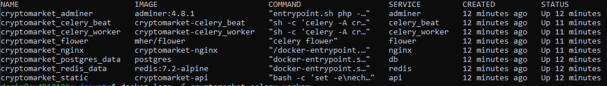](./img/docker_remorte.png) ||[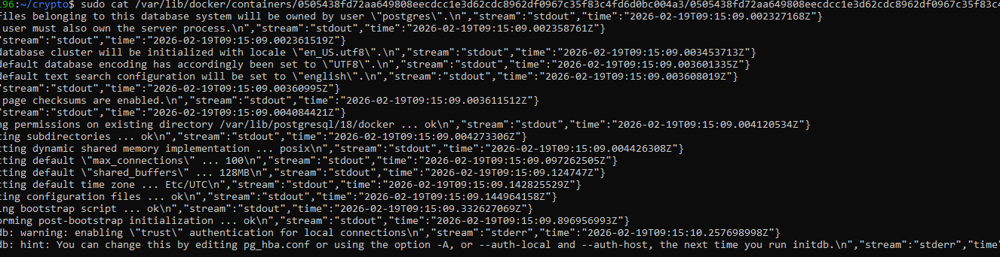](./img/log_cryptomarket_postgres_data.png)||[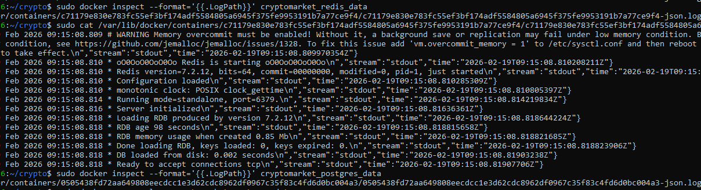](./img/log_cryptomarket_redis_data.png)||[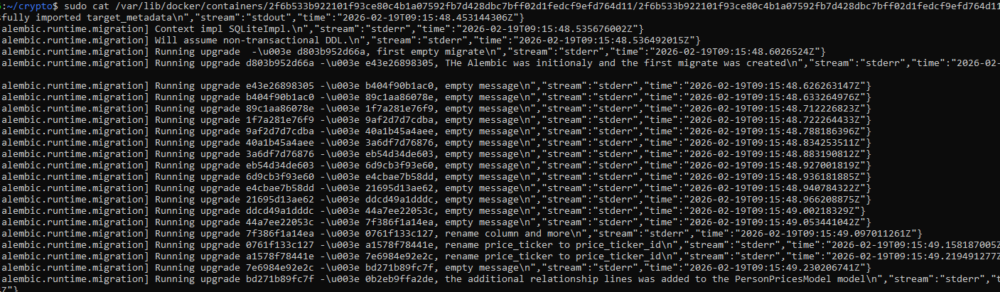](./img/log_cryptomarket_static.png)||
|||||||[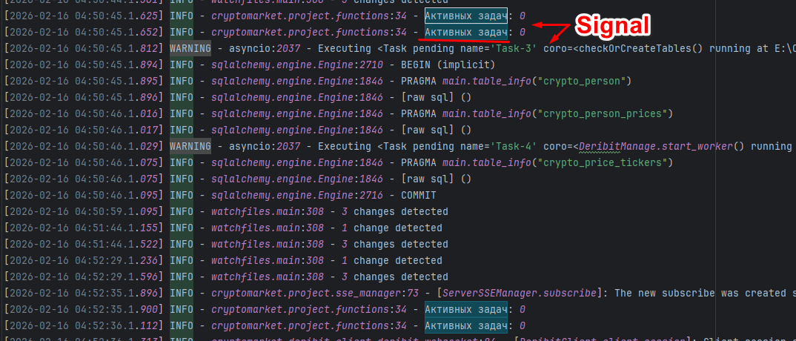](./img/logs.png)||

#### Note
Логи app когда код обвернут в функцию контроля/утечки памяти. Сейчас контроль снят. Сама [функция тут](cryptomarket/project/functions.py).

----


parrameter: 'url/?timer=5' Пользователь устанавливает время в секундах. Время для \
временного интервала (обновления данных). По умолчанию 60 секунд


----

---
Получаем данные пользователя и сохраняем (пользователя) в кеше по ключём "`deribit:person:%s`"  

--- 


## Tree
```text
root
├── .github
│   |   └──workflows
│   |       └──main.yml
├── __tests__
│   |   ├──fixtures
│   |   |   └──.py
│   |   ├──test_database_connections
│   |   |   └──.py
│   |   ├──test_derbit_clients
│   |   |   └──.py
│   |   └──test_midllware
│   |       └──.py
├── alembic
├── cryptomarket
│   ├──api
│   |   ├──v1
│   |   |    └──.py
│   |   ├──v2
│   |   |    └──.py
│   |   └──.py
│   ├──database
│   |   └──*.py
│   ├──deribit_client
│   |   └──*.py
│   ├──errors
│   |   └──*.py
│   ├──models
│   |   ├──persons
│   |   |    └──*.py
│   |   ├──schemes
│   |        └──*.py
│   ├──project
│   |   ├──settings
│   |   └──*.py
│   |
│   ├──tasks
│   |   ├──celery
│   |   |    └──*.py
│   |   └──queues
│   |        └──*.py
│   ├──type
│   |   └──*.py
├── img
├── nginx
├── .coverage
├── .dockerignore
├── .editorconfig
├── .env
├── .flake8
├── .gitignore
├── .pre-commit-config.yaml
├── .pylintrc
├── alembic.ini
├── celerybeat-schedule
├── docker-compose.yml
├── Dockerfile
├── log_putout.log
├── logs.py
├── poetry.lock
├── pull.exp
├── pull.sh
├── pytest.ini
├── README.md

```
## .ENV Files
```text
APP_PROTOCOL=http
APP_HOST=127.0.0.1
APP_PORT=8003
REDIS_URL=redis://< external_server_host >:< external_server_port >
REDIS_DB=0
REDIS_HOST=< IP/domen_of_host >
REDIS_PORT=< port >

DEBUG=True # True That mean You are working in local SQLIte database  

REDIS_MASTER_NAME=< user_By_ssh_of_external_server >
REDIS_PASSWORD= < password_By_ssh_of_external_server > 

POSTGRES_USER= < user_database >
POSTGRES_PASSWORD= < password_database >
POSTGRES_PORT=< port_database>
POSTGRES_HOST=db
POSTGRES_DB=< dabase_name >

COMPOSE_PROJECT_NAME= < project_name >

FLOWER_USER= < user_login > # Firs you need uncomment the block flower from docker-compose file.
FLOWER_PASSWORD= < user)password >


## view dababase when you are working on the 'DEBUG=False' (above) mode
#PROJECT_MODE=testing # If You want. Note/ I self wark on the 'development'. 
## For development
PROJECT_MODE=development
## Prodo 
#PROJECT_MODE=production # for external IP/database. If you want. 

```

## Celery worker & beat
||||
|:----|:----|:----|
|[](./img/celery_cache.png)||[](./img/celery_deribit.png)|

## Testing 
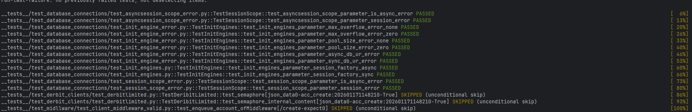

## Postman Test
|v1_currency API||log Server|
|:-----|:-----|:-----|
|[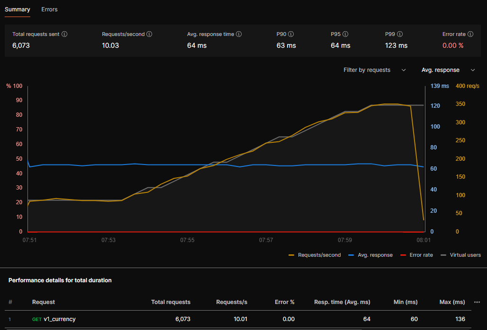](./img/postman_test.png)||[](img/Postmane_test_server_log.png)|
|v1_currency_filter API|||
|[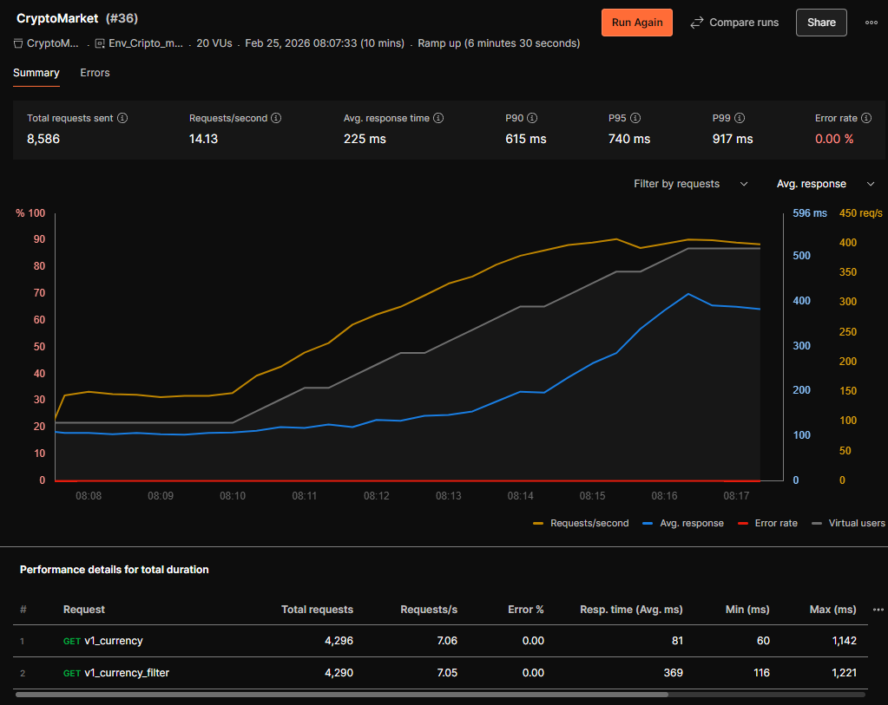](./img/Postmane_test_server_2.png)||[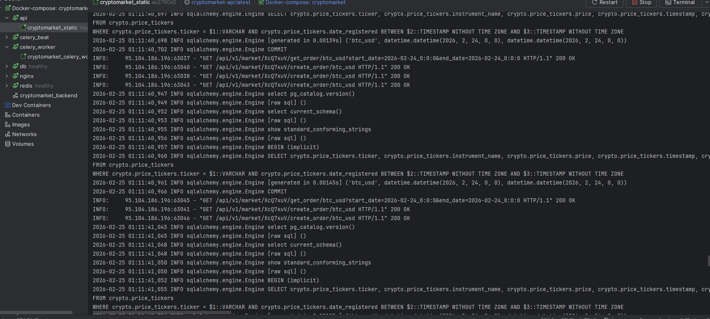](img/Postmane_test_server_log_2.png)|
|database at the time of testing|||
|[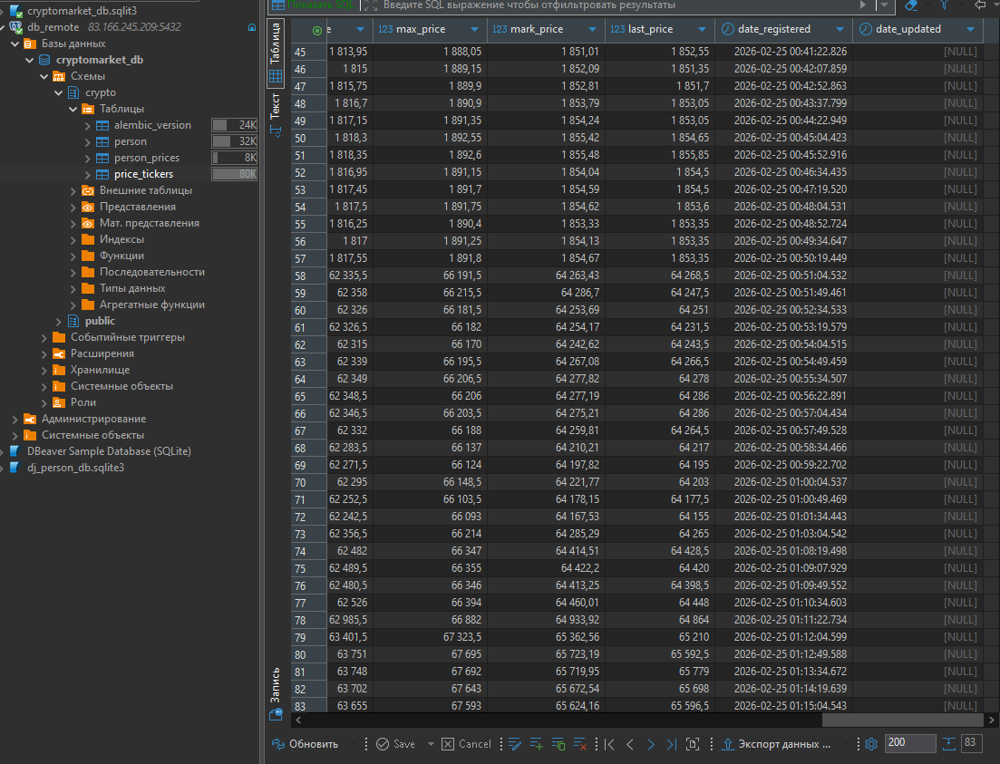](./img/Postman_test_db.png)|||

----
## Commands
```
# =====================
# FastAPI
# =====================

uvicorn main:app --host 0.0.0.0 --port 8003 --reload

# =====================
# GITHUB
# =====================

git clone <url_repo.git > # - Клонировать репозиторий 
git log --all --oneline --graph --decorate --date=format:'%Y-%m-%d %H:%M:%S' --pretty=format:'%C(yellow)%h%C(auto)%d %C(white)%cd%Creset %s' # - история развития проекта

# =====================
# CICD & GITHUB ACTIONS
# =====================

# == pull.exp
#!/usr/bin/expect -f
set timeout 600
spawn /home/< user name >/crypto/pull.sh
expect "password"
send "< your password >\r"
expect eof

# == pull.sh
#!/bin/bash
cd /home/< user name >/crypto || { echo "Directory not found"; exit 1; }

# Git pull с проверкой
echo "Updating code from git..."
git pull --ff-only origin dev || { echo "Git pull failed"; exit 1; }

# Функция для безопасного выполнения команд
safe_exec() {
    if ! "$@"; then
        echo "Warning: Command failed: $*"
        return 1
    fi
    return 0
}

# Остановка сервисов Docker Compose
echo "Stopping Docker Compose services..."
safe_exec sudo docker compose down

# 1. Останавливаем и удаляем ТОЛЬКО контейнеры, связанные с проектом
echo "Cleaning up project containers..."
PROJECT_CONTAINERS=$(sudo docker ps -a --filter "name=cryptomarket" --filter "name=fastapi" -q)
if [ -n "$PROJECT_CONTAINERS" ]; then
    sudo docker stop $PROJECT_CONTAINERS 2>/dev/null || true
    sudo docker rm -f $PROJECT_CONTAINERS 2>/dev/null || true
    echo "✓ Project containers removed"
fi

# 2. Удаляем зависшие контейнеры (не все!)
echo "Removing dangling containers..."
sudo docker container prune -f || true

# 3. Удаляем неиспользуемые образы, но СОХРАНЯЕМ базовые
echo "Cleaning up unused images (keeping base images)..."
# Удаляем только образы с тегом <none> (dangling)
sudo docker image prune -f || true
# Не удаляем все образы! Комментарий: sudo docker rmi $(sudo docker images -q) - НЕ ДЕЛАЕМ!

# 4. Удаляем неиспользуемые тома (volumes) проекта
echo "Cleaning up unused volumes..."
# Удаляем только тома без меток или старые
sudo docker volume ls -qf dangling=true | xargs -r sudo docker volume rm || true

# 5. Удаляем неиспользуемые сети
echo "Cleaning up unused networks..."
sudo docker network prune -f || true

# 6. Очистка билдера (BuildKit cache)
echo "Cleaning up builder cache..."
sudo docker builder prune -f || true

# 7. Удаляем старые образы, но сохраняем последние 5 версий (опционально)
# echo "Keeping only recent images..."
# sudo docker image prune -a --filter "until=24h" -f || true

echo "Pulling latest images (if needed)..."
sudo docker compose pull || true

echo "Starting services..."
sudo docker compose -f ./docker-compose.yml up -d

# Проверка статуса
echo "Checking service status..."
sleep 5
sudo docker compose ps

echo "✅ Deployment completed successfully"


# =====================
# CELERY
# =====================
  
celery -A cryptomarket.project.celery_ worker --loglevel=info --pool=solo 
 # 'solo' - для работы на windows.
 # '--concurrency=1'  количество воркеров Celery (По желанию) уменьшить нагрузку.    
celery -A cryptomarket.project.celery_ beat --loglevel=info

# =====================
# SWAP для подкачки рессурсов на слабый сервер
# =====================

# Создаем swap-файл 2GB
sudo fallocate -l 2G /swapfile
# или
# Если fallocate не работает:
sudo dd if=/dev/zero of=/swapfile bs=1M count=2048

# Правильные права пользователю на сервере
sudo chmod 600 /swapfile

# Форматируем под swap
sudo mkswap /swapfile

# Включаем swap
sudo swapon /swapfile

# Проверяем
free -h
# Должны увидеть: Swap: 2.0G

# Делаем постоянным
echo '/swapfile none swap sw 0 0' | sudo tee -a /etc/fstab
```
----

## Swagger
| **WEB Swagger**                                                                                    || **WEB Swagger**                                                    || **Swagger Postman**                                           |
|:---------------------------------------------------------------------------------------------------|:----|:-------------------------------------------------------------------|:----|:--------------------------------------------------------------|
| [](./img/swagger_web.png)                                     || [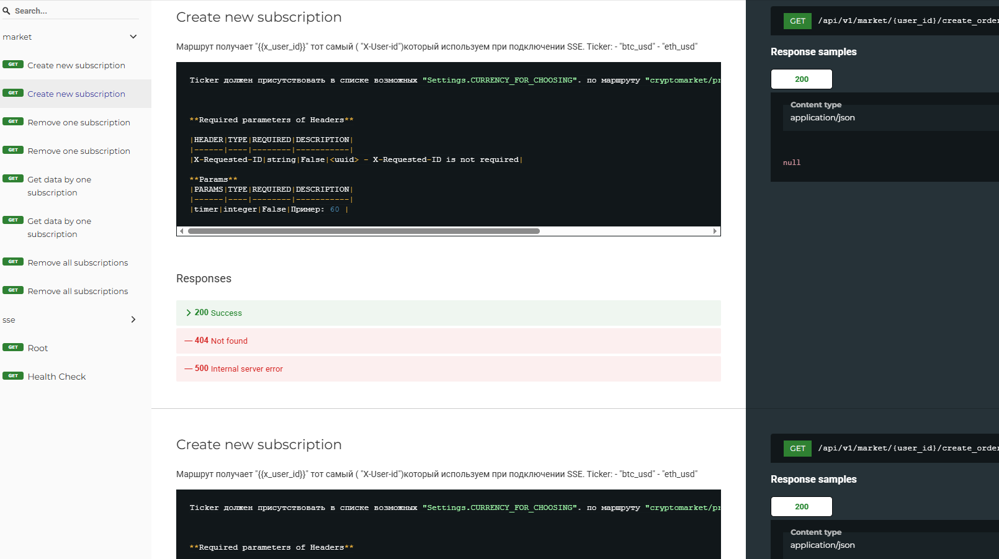](./img/swsagger_web_2.png)|| [](./img/swagger_web.png)|
| [файл swagger](CryptoMarket.postman_collection.json)                                               ||                                                                    ||                                                               |

----

## URL 
```text
{URL}/docs # root OpenApi 
{URL}/redoc # root OpenApi
{URL}//health # Health check endpoint
```
## API
```text
GET: {URL}/api/v2/sse/connection # Connection SSE
GET: {URL}/api/v1/market/{user_id}/create_order/{ticker} # Subscriptions
GET: {URL}/api/v1/market/{{x_user_id}}/cancel_order/{{ticker}} # Remove one subscription 
GET: {URL}/api/v1/market/{user_id}/cancel_all_orders # Remove all subscriptions
GET: {URL}http://127.0.0.1:8003/api/v1/market/{user_id}/get_order/{ticker} # Filter dates
 
```
