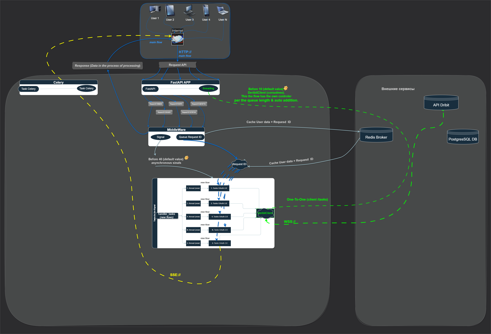

Note: Публикация файлов не нарушило условий задания 
## APP CryptoMarket
 

Person чтоб платформа не:
     - зависила от от пользователей,
     - и не несла ответственности за действия пользователей

<<<<<<< HEAD
Данные об успешной авторизации кешируем на 27 часов. и сразу отправляю сообщение по SSE/ D cjj,otybb токены.

=======
Промежуточная функция перехватывает данные полльзователя и шифрует секретный клю. После этот ключ отправляется в кеш. 
Уже из кеша , когда получаем этот ключ (в одной из задачи) то де-шифровка секретного текста для аутентификации пользователя.

Данные об успешной авторизации кешируем на 27 часов. и сразу отправляю сообщение по SSE. В сообщении токены.

args = ("btc_usd", "eth_usd", "connection")
ServerSSEManager(args) на старте получает kricers.  

Каждый пользователь имеет разовый уникальный ключь шифра на время жизни секретных данных. 
Ключи это результат генератора. 

parrameter: 'url/?timer=5' Пользователь устанавливает время в секундах. Время для \
временного интервала (обновления данных). По умолчанию 60 секунд

Authentication https://docs.deribit.com/articles/authentication \

----

Мы знаем - Полиморфизм. Но это в ООП. Тут же говорю о целом APP. Стараюсь делать единый код для выполнения разных задач \
Изменения только в args/kwargs
---
Даб понимаю , что работа занимает более 10 дней указанного deadline. Но и \
делвть по принципу "а лишь бы было" нет желания. \
Да, мог сделать:
- HTTP запросы напрямую по внешнему API.
- Без кеширования. 
- Без update базы данных раз в сутки. 

Работа имела 3 версии. 

 - Когда получаем access токен, закрываем соединение. Далее по токену делаем новое подключение для получения \
   новых данных. Но токен выдается именно на сессию/подключение.  
 - Когда одно WSS подключение для реализации задач. Имея разные локальные API имеет одно wss подключение на \
    одного пользователя (one-to-one). Но получил ограничение по трафику (до 15 запросов в секунду). Стал терял запросы\
    в локальной очерези.
    АРР имеет ряд локальных очередей. Очереди имеют лиш ключи от кеша. Из кеша получаем словарь/json (строку) \
        для запроса на внешний сервер. Тут конечно моя оплошность - один и тот же API запрашиваю от \
    разных пользователей (нагрузка не нужная).
 - Когда один API запрашиваем от APP 9а не от пользователя). Пользователь пользочает данные уже из db. Снижаем нагрузку.

Возможно стоит учесть, что с этой биржей работал в первый раз. Работа была без какого либо ТЗ, всё создавалось на ходу.  

---
Подлючая SSE у пользователя появляются email имя для обрачения  

---
Получаем данные пользователя и сохраняем (пользователя) в кеше по ключём "`deribit:person:%s`"  

--- 
`'cryptomarket.tasks.celery.task_add_every_60_seconds.task_celery_monitoring_currency'` Задача запускается с интервалом в 45 секунд.\
Проверяет кеш. Если пусто, уходит спать. \
Если Есть тикер, отправляется запрос на дерибит. и ответ сохраняем в базу данных. 

Задача настроена работать на poistgresql & sqlite . Синхронная и асинхронная сессия. 

49 секунд, "queue" есть "high" и ключ "routing_key": "high.priority".
